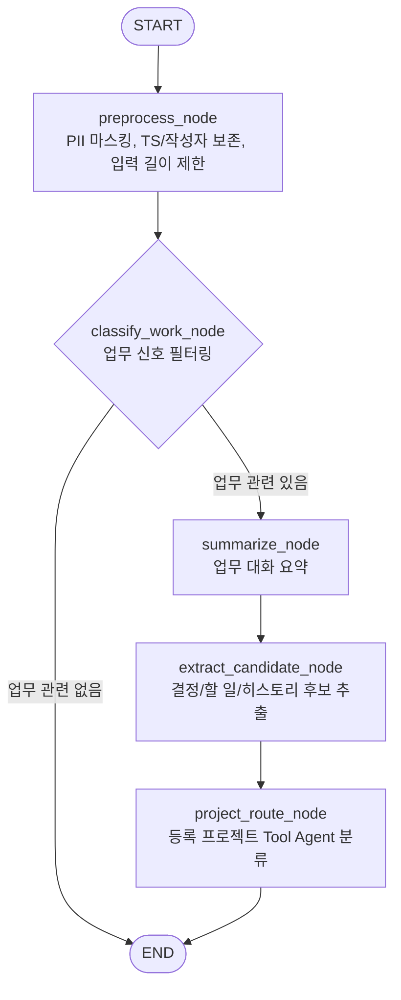

# Slack Agent LangGraph 현재 구조

작성일: 2026-05-15

이 문서는 현재 `agent_slack/agent_slack.py` 기준 Slack Agent LangGraph 흐름을 설명한다. Slack Agent는 Slack 원본 메시지를 바로 trusted knowledge로 저장하지 않고, 업무 후보를 추출한 뒤 `ReviewItem(status='pending_review')`로 넘기는 역할만 한다.

## 전체 흐름

## 상태 모델

`SlackAgentState`는 그래프 전 구간에서 다음 정보를 들고 이동한다.

- `channel_id`: Slack 채널 id.
- `messages`: Slack 원본 메시지 목록. 각 메시지는 `ts`, `source_id`, `user`, `user_name`, `text`를 포함할 수 있다.
- `processed_text`: PII 마스킹과 업무 필터링을 거친 대화 텍스트.
- `is_work_related`: 업무 후보로 볼 수 있는지 여부.
- `summary`: LLM 요약 결과.
- `candidates`: `ReviewCandidate` 목록. 최종적으로 Review Queue 저장 대상이 된다.
- `projects`: DB에 등록된 프로젝트 목록을 `ProjectOption` 형태로 전달한 값.
- `project_router_model`: 테스트 또는 외부 주입용 프로젝트 router model. 없으면 LangChain `create_agent` wrapper를 만든다.
- `project_prompt_tokens`, `project_completion_tokens`, `project_model_name`: 프로젝트 분류 단계의 비용/모델 관측값.
- `model_name`, `total_prompt_tokens`, `total_completion_tokens`: 전체 AgentRun 비용 계산용 모델/토큰 값.
- `openai_api_key`, `gemini_api_key`: live LLM 실행용 provider key.

## 노드별 역할

### 1. `preprocess_node`

- 메시지를 `ts` 기준으로 정렬한다.
- `[HH:MM:SS] 작성자: 본문 [TS: ...]` 형태로 대화록을 만든다.
- 주민등록번호, 전화번호, 이메일을 마스킹한다.
- `AGENT_LLM_MAX_INPUT_CHARS`를 넘으면 입력을 잘라 비용 폭주를 막는다.

출력:

- `processed_text`
- `model_name='gpt-4o-mini'`

### 2. `classify_work_node`

- 먼저 deterministic `classify_slack_work_signal()`로 저신호 메시지를 걸러낸다.
- `후...`, `굿굿`, 단독 인사/감사처럼 업무 근거가 없는 메시지만 있으면 LLM 호출 없이 `END`로 종료한다.
- 업무 신호가 있는 메시지만 `ChatOpenAI(gpt-4o-mini)`에 보내서 남길 가치가 있는 메시지 index를 고른다.
- 선택된 메시지만 다시 `processed_text`로 압축한다.

출력:

- `is_work_related`
- 압축된 `processed_text`
- 누적 prompt/completion token

### 3. `summarize_node`

- 필터링된 업무 대화록을 `gpt-5-mini`로 요약한다.
- 작성자 전체 이름과 `[TS: ...]` 값을 유지하도록 지시한다.
- 요약은 이후 지식 후보 추출의 입력이 된다.

출력:

- `summary`
- `model_name`
- 누적 token

### 4. `extract_candidate_node`

- `CandidateList` structured output으로 `decision_record`, `todo`, `history_event` 후보를 추출한다.
- 각 후보는 `ReviewCandidate`로 변환된다.
- Slack `ts` 값을 Slack permalink로 변환해 `source_links`에 보존한다.
- `source_snippets`, `confidence_score`, `permission_level`, `payload_fields`를 함께 보존한다.
- OpenAI structured output 실패 시 Gemini fallback을 시도한다.

출력:

- `candidates`
- 누적 token

### 5. `project_route_node`

- `projects` 또는 `candidates`가 비어 있으면 아무 작업도 하지 않는다.
- 등록 프로젝트가 있으면 LangChain tool-calling router를 실행한다.
- router는 다음 tool을 사용할 수 있다.
  - `list_registered_projects`: 등록 프로젝트 목록을 JSON으로 반환한다.
  - `score_project_candidates`: evidence text와 프로젝트 설명을 deterministic 점수로 비교한다.
- 결과는 기존 `ReviewCandidate.payload_fields`에 추가된다.

추가되는 필드:

- `project_key`
- `project_name`
- `project_assignment_method='llm_tool'`
- `project_assignment_summary`
- `project_assignment_reason`
- `project_assignment_confidence`
- `project_alternatives`
- `project_needs_user_selection`

이 값은 승인 전 trusted knowledge가 아니며, Review 화면에서 사용자가 프로젝트를 바꾸거나 승인해야 프로젝트 활동으로 확정된다.

## 실행 엔트리포인트

`process_daily_slack_sync()`가 그래프를 실행한다.

입력:

- `channel_id`
- `messages`
- `openai_api_key`
- `gemini_api_key`
- `projects`
- `project_router_model`

출력:

- 최종 graph state dict
- `run_cost`: `AgentRunCost`
- `candidates`: Review Queue 저장 대상 후보 목록

## DB 저장 경계

LangGraph는 DB에 직접 쓰지 않는다. 저장은 `backend/app/agents/slack_agent/sync_service.py`가 담당한다.

저장 흐름:

1. `Source`, `DocumentVersion`에서 Slack 메시지를 읽는다.
2. 채널별로 `process_daily_slack_sync()`를 호출한다.
3. 실행 결과를 `AgentRun(agent_name='slack_agent_v2')`으로 저장한다.
4. 각 `ReviewCandidate`를 `ReviewItem(status='pending_review')`으로 저장한다.
5. 프로젝트 라우팅 결과는 `ReviewItem.payload`와 `AgentRun.metadata_.project_routing`에 보존한다.

## 비용과 안전 경계

- 전체 Slack corpus를 그대로 LLM에 보내지 않고, deterministic 업무 신호 필터를 먼저 거친다.
- 프로젝트 분류는 추출된 후보와 등록 프로젝트 목록만 입력으로 사용한다.
- `project_route_node`는 source permission level을 넓히지 않는다.
- Slack LLM project routing으로 후보가 생성된 sync에서는 기존 deterministic `project_assignment` 중복 생성을 건너뛴다.
- provider key가 없거나 live LLM 경로가 아닌 경우 기존 deterministic 프로젝트 분류 fallback은 유지된다.

## 현재 주의점

- 자동 테스트에서는 live LLM을 호출하지 않고 fake model 또는 monkeypatch를 사용한다.
- `project_route_node`는 후보가 만들어진 뒤에만 실행되므로, 저신호 Slack 메시지는 프로젝트 분류 단계까지 가지 않는다.
- Review 승인 전까지 모든 LLM 출력은 검토 후보이며 공식 회사 지식이 아니다.
