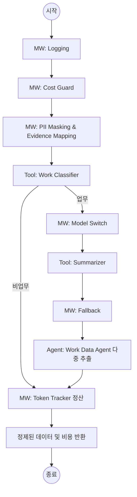

# 상세 설계서: Slack 지식 추출 에이전트 (Communication Intelligence)

본 문서는 사용자의 **동기화 요청 또는 예약된 시간**에 슬랙 대화를 일괄 수집하여 기업의 핵심 업무 데이터를 선별하고 지식화하기 위한 에이전트, 툴, 미들웨어 구성을 정의합니다.

---

## 1. 공통 원칙 (Common Rules)
- **일괄 동기화 실행(Batch/Sync-Driven)**: 실시간 이벤트 감시 방식 대신 사용자가 '동기화' 버튼을 누르거나 설정된 스케줄에 따라 하루 치 대화를 한 번에 수집하고 분석하여 API 비용 및 리소스를 최적화한다.
- **로깅 우선(Logging First)**: 모든 에이전트, 툴, 미들웨어 호출 시 입출력 및 실행 시간을 기록한다.
- **증거 기반(Evidence-First)**: 모든 추출 데이터는 원문 링크와 발언자 정보를 포함해야 한다.
- **보안 준수(Security)**: 외부 LLM으로 데이터가 전송되기 전 반드시 PII 마스킹을 거친다.

---

## 2. 컴포넌트 구성 (Component Specification)

### 2.1 에이전트 (Agents)
| 명칭 | 역할 | 비고 |
| :--- | :--- | :--- |
| **Work Data Agent** | 수집된 하루 치 대화 중 업무 데이터 선별/정리 | 일괄 동기화 파이프라인 |

### 2.2 툴 (Tools)
| 명칭 | 기능 | 기술 스택 |
| :--- | :--- | :--- |
| **Slack History Fetcher** | 특정 기간(하루) 동안의 채널 메시지 및 스레드 일괄 수집 | Slack Conversations API |
| **Work Classifier** | 업무 데이터 여부 분류 (Binary Classification) | gpt-4o-mini |
| **Summarizer** | 배치 처리된 대화 요약 | LLM (Middleware 2 연동) |
| **Evidence Preserver** | 추출된 지식과 원본 메시지(TS/Link)의 맵핑 | 텍스트 전처리 및 구조화 매핑 |

### 2.3 미들웨어 (Middlewares)
| 순서 | 명칭 | 역할 | 정책 |
| :--- | :--- | :--- | :--- |
| 1 | **Logging MW** | 실행 기록 저장 | DB/로그 파일 기록 |
| 2 | **Cost Guard MW** | 예산 및 길이 제한 검사 | 입력 길이 30000자 초과 시 안전하게 Truncation/Chunking (필터링 효율 증대) |
| 3 | **Context Compression MW** | 비업무 대화 제거 | 저비용 모델(mini)로 업무 메시지만 선별하여 고성능 모델의 토큰 소모 최소화 |
| 4 | **PII Detector** | 민감 정보 마스킹 | 주민번호, 휴대폰, 주소 등 (Regex) |
| 4 | **Model Switcher** | 고성능 모델 전환 | 요약 시 데이터량에 따라 상위 모델(gpt-4o)로 교체 |
| 5 | **Fallback MW** | 오류 발생 시 모델 교체 | 기본 모델 실패 시 Gemini 3.1 Pro 등 폴백 사용 |
| 6 | **Token Tracker MW** | API 호출 비용 및 토큰 정산 | LLM 호출 시 발생한 토큰 및 USD 비용 누적 계산 |

---

## 3. 워크플로우 설계 (Workflow Diagram)

---

## 4. 구현 가이드라인 (Implementation Notes)

### 4.1 데이터 정제 및 반환 (Data Processing & Return)
- **자동화된 흐름**: `agent_slack`은 슬랙 원본 데이터를 수집한 후 분류, 요약, 개인정보 마스킹을 거쳐 최종적으로 정제된 업무 데이터를 반환한다.
- **결과 활용**: 반환된 결과물은 즉시 데이터베이스에 기록되거나 RAG를 위한 인덱싱 과정으로 전달된다.

### 4.2 개인정보 보호 (PII)
- 외부 API 호출 전 `body` 텍스트를 검사하여 `[MASKED]` 처리를 수행한다.
- 정규표현식을 활용하여 성능 저하를 최소화한다.

### 4.3 모델 폴백 (Fallback)
- HTTP 429(Rate Limit) 또는 5xx 에러 발생 시 즉시 다른 프로바이더(Gemini 등)로 요청을 라우팅한다.

---
**업데이트 일자**: 2026-05-07
**작성자**: 개발자 A (Coding Assistant)
