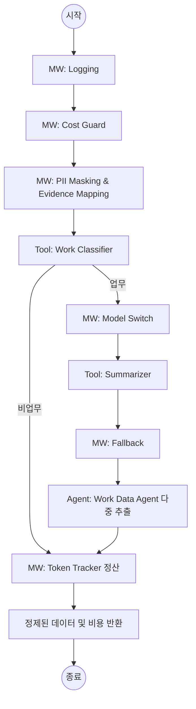

# 상세 설계서: Slack 지식 추출 에이전트 (Communication Intelligence)

본 문서는 사용자의 **동기화 요청 또는 예약된 시간**에 슬랙 대화를 일괄 수집하여 기업의 핵심 업무 데이터를 선별하고 지식화하기 위한 에이전트, 툴, 미들웨어 구성을 정의합니다.

---

## 1. 공통 원칙 (Common Rules)
- **일괄 동기화 실행(Batch/Sync-Driven)**: 실시간 이벤트 감시 방식 대신 사용자가 '동기화' 버튼을 누르거나 설정된 스케줄에 따라 하루 치 대화를 한 번에 수집하고 분석하여 API 비용 및 리소스를 최적화한다.
- **로깅 우선(Logging First)**: 모든 에이전트, 툴, 미들웨어 호출 시 입출력 및 실행 시간을 기록한다.
- **증거 기반(Evidence-First)**: 모든 추출 데이터는 원문 링크와 발언자 정보를 포함해야 한다.
- **보안 준수(Security)**: 외부 LLM으로 데이터가 전송되기 전 반드시 PII 마스킹을 거친다.

---

## 2. 컴포넌트 구성 (Component Specification)

### 2.1 에이전트 (Agents)
| 명칭 | 역할 | 비고 |
| :--- | :--- | :--- |
| **Work Data Agent** | 수집된 하루 치 대화 중 업무 데이터 선별/정리 | 일괄 동기화 파이프라인 |

### 2.2 툴 (Tools)
| 명칭 | 기능 | 기술 스택 |
| :--- | :--- | :--- |
| **Slack History Fetcher** | 특정 기간(하루) 동안의 채널 메시지 및 스레드 일괄 수집 | Slack Conversations API |
| **Work Classifier** | 업무 데이터 여부 분류 (Binary Classification) | gpt-4o-mini |
| **Summarizer** | 배치 처리된 대화 요약 | LLM (Middleware 2 연동) |
| **Evidence Preserver** | 추출된 지식과 원본 메시지(TS/Link)의 맵핑 | 텍스트 전처리 및 구조화 매핑 |

### 2.3 미들웨어 (Middlewares)
| 순서 | 명칭 | 역할 | 정책 |
| :--- | :--- | :--- | :--- |
| 1 | **Logging MW** | 실행 기록 저장 | DB/로그 파일 기록 |
| 2 | **Cost Guard MW** | 예산 및 길이 제한 검사 | 입력 길이 30000자 초과 시 안전하게 Truncation/Chunking (필터링 효율 증대) |
| 3 | **Context Compression MW** | 비업무 대화 제거 | 저비용 모델(mini)로 업무 메시지만 선별하여 고성능 모델의 토큰 소모 최소화 |
| 4 | **PII Detector** | 민감 정보 마스킹 | 주민번호, 휴대폰, 주소 등 (Regex) |
| 4 | **Model Switcher** | 고성능 모델 전환 | 요약 시 데이터량에 따라 상위 모델(gpt-4o)로 교체 |
| 5 | **Fallback MW** | 오류 발생 시 모델 교체 | 기본 모델 실패 시 Gemini 3.1 Pro 등 폴백 사용 |
| 6 | **Token Tracker MW** | API 호출 비용 및 토큰 정산 | LLM 호출 시 발생한 토큰 및 USD 비용 누적 계산 |

---

## 3. 워크플로우 설계 (Workflow Diagram)

---

## 4. 구현 가이드라인 및 기술 진화 (Implementation & Evolution)

### 4.1 개발 이력 (Development History)
| 날짜 | 단계 | 내용 | 비고 |
| :--- | :--- | :--- | :--- |
| **2026-05-07** | **MVP (기초 수집)** | 슬랙 히스토리 수집 및 단순 요약 기능 구현 | 기본 파이프라인 구축 |
| **2026-05-08** | **수집 범위 확장** | `im`, `mpim` 자동 감지 및 User Token 하이브리드 연동 적용 | DM 사각지대 해소 |
| **2026-05-11** | **지능형 고도화** | **LangChain Structured Output 기반 4대 업무 분류 체계 도입** | 본 문서 4.4절 참조 |

### 4.2 데이터 추출 방식의 진화
1. **기존 방식 (Summary-Only)**: 전체 대화를 하나의 텍스트 덩어리로 요약. 정보의 휘발성이 높고 나중에 특정 프로젝트 내용만 추출하기 어려움.
2. **시도 및 개선 (Structured Metadata)**: LLM이 단순 텍스트가 아닌 JSON 구조를 반환하도록 설계. 업무 성격(Category), 지식 유형(Type), 구체적 토픽(Tag)의 3차원 메타데이터를 강제 추출함.
3. **적용 결과**: 지식의 '검색 가능성(Searchability)'과 '통계적 분석 가능성' 확보.

### 4.3 개인정보 보호 및 폴백
...

### 4.4 지식 분류 체계 (Knowledge Taxonomy)
추출된 모든 지식은 다음의 4가지 카테고리 중 하나로 반드시 분류되어야 하며, 이는 LangChain의 Structured Output 기능을 통해 메타데이터로 저장된다.

| 카테고리 | 정의 | 예시 |
| :--- | :--- | :--- |
| **Project** | 명확한 기한과 목표가 있는 신규 기획/개발 건 | 홈페이지 리뉴얼, 신규 기능 명세 확정 |
| **Operations** | 상시 발생하는 서비스 운영 및 유지보수 관리 | 정기 배포, DB 성능 모니터링 결과 공유 |
| **Administration** | HR, 재무, 법무 등 부서 공통 지원 업무 | SW 라이선스 갱신, 신규 입사자 온보딩 가이드 |
| **Ad-hoc** | 특정 카테고리에 속하지 않는 단발성 이슈 대응 | 갑작스러운 서버 장애 대응, 긴급 버그 핫픽스 |

---

## 5. 업데이트 및 변경 이력 (Update History)

### [2026-05-12] 백엔드 API 통합 및 대시보드 실데이터 연동
- **수정 사항 1**: `/api/v1/integrations/slack/sync` 호출 시 에이전트 분석 로직이 자동 트리거되도록 통합.
- **수정 사항 2**: 에이전트 추출 결과를 `review_items` 테이블의 JSON `payload`에 정확히 매핑하여 영구 저장.
- **수정 사항 3**: 프론트엔드 대시보드 UI에 백엔드 실데이터 바인딩 완료 (분석된 할 일 및 검토사항 표시).
- **효과**: 사용자가 직접 제어하는 동기화-분석-시각화의 전체 제품 수명 주기(Product Life-cycle) 완성.

### [2026-05-11] 지능형 지식 구조화 및 대시보드 시각화 연동
- **수정 사항 1**: `extract_candidate_node`의 출력 구조를 Pydantic 기반 Structured Output으로 전환.
- **수정 사항 2**: 대시보드 '오늘의 업무' 표시를 위한 **담당자(Assignee) 및 마감 기한(Due Date) 추출 로직** 추가.
- **수정 사항 3**: 추출된 데이터를 시각화할 수 있는 **임시 프론트엔드 대시보드(`/dashboard-mock`)** 구축.
- **적용 기술**: LangChain 1.0 `with_structured_output`, Next.js/Tailwind CSS, 4대 업무 분류(Taxonomy).
- **효과**: 요약 데이터의 검색 필터링 강화 및 실행 가능한 업무(Actionable Tasks)의 시각적 가시성 확보.

### [2026-05-08] 수집 범위 확장 및 권한 체계 개선
- **수정 사항**: `conversations.list` API 필터링 조건에 `im`, `mpim` 추가.
- **적용 기술**: User Token 하이브리드 연동 아키텍처.
- **효과**: 1:1 및 그룹 DM 내 휘발성 업무 데이터 수집 사각지대 해소.

### [2026-05-07] MVP 초기 구축
- **수정 사항**: 기본 슬랙 히스토리 수집 및 요약 파이프라인 구축.
- **적용 기술**: Slack Web API, OpenAI GPT-4o-mini.
