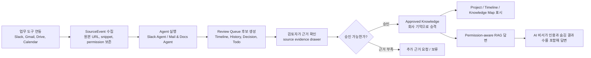
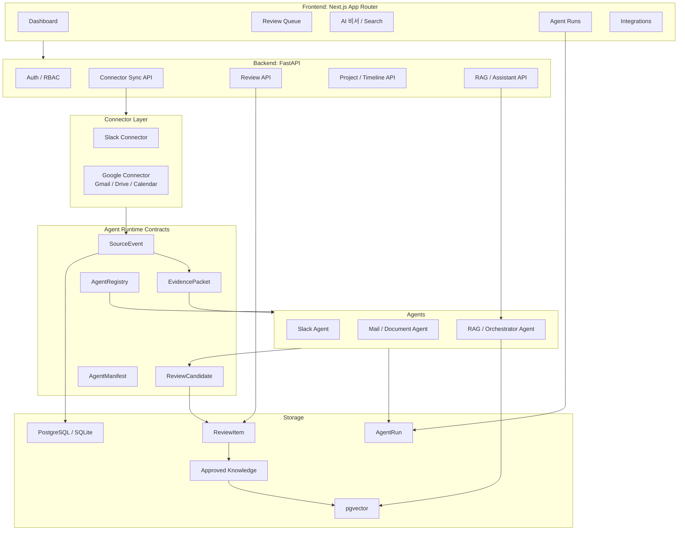
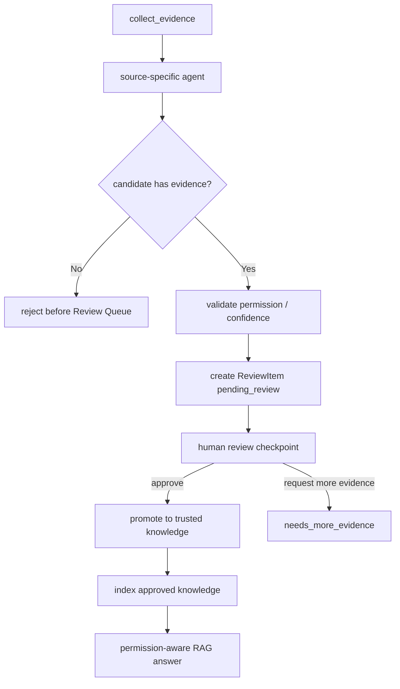

# ParaWorks 포트폴리오 케이스 스터디

## 프로젝트 한줄 요약

ParaWorks는 Slack, Gmail, Google Drive, Calendar에 흩어진 업무 대화와 문서를 **근거 기반 회사 기억**으로 변환하고, AI가 생성한 후보를 사람의 검토 후 승인된 지식으로만 승격시키는 한국어 우선 Multi-Agent Company Memory 플랫폼입니다.

## 문제 정의와 배경

팀의 중요한 의사결정, 일정, 담당 업무, 회의 맥락은 보통 Slack 메시지, 이메일, 문서, 캘린더에 분산되어 있습니다. 시간이 지나면 “왜 이 결정을 했는가”, “어떤 근거로 이 일정이 생겼는가”, “이 답변을 믿어도 되는가”를 확인하기 어렵습니다.

이 프로젝트에서 해결하려 한 핵심 문제는 단순히 문서를 검색하거나 챗봇으로 답하는 것이 아니라, 다음 조건을 만족하는 업무 기억 시스템을 만드는 것이었습니다.

- AI 결과가 반드시 원본 근거 링크, 스니펫, 권한, 신뢰도와 함께 남아야 한다.
- LLM이 만든 결과는 곧바로 회사 지식이 되지 않고 Review Queue를 통과해야 한다.
- 승인된 지식만 Timeline, History, Decision, Todo, RAG 답변에 사용되어야 한다.
- Slack, Gmail, Drive, Calendar처럼 서로 다른 소스도 같은 계약으로 처리되어야 한다.
- 여러 개발자와 여러 LLM 코딩 에이전트가 동시에 작업해도 스키마와 책임 경계가 무너지지 않아야 한다.
- 동기화, 임베딩, LLM 호출 비용이 폭증하지 않도록 중복 제거와 비용 추적이 필요하다.

## 사용자 시나리오

대표 사용 흐름은 다음과 같습니다.

1. 사용자가 연동 관리에서 Slack 또는 Google 계정을 연결하고 동기화를 실행합니다.
2. 커넥터는 원본 데이터를 `SourceEvent`로 정규화하면서 원본 링크, 작성자, 참여자, 권한, 스니펫, 외부 id를 보존합니다.
3. Slack Agent와 Mail/Document Agent가 근거 묶음을 분석해 업무 후보를 생성합니다.
4. Review Queue에서 검토자가 후보의 원본 근거, 신뢰도, 프로젝트 라우팅 결과를 확인합니다.
5. 승인된 항목만 Decision, Timeline, History, Todo, Knowledge Library로 승격됩니다.
6. 사용자가 AI 비서나 검색 화면에서 질문하면, RAG는 승인된 지식과 권한 필터를 기준으로 답변합니다.
7. Agent Runs 화면에서는 실행 비용, 토큰 사용량, 캐시, evidence window, 실패 여부를 확인할 수 있습니다.

## 핵심 기능 목록

### Evidence-first Ingestion

- Slack, Gmail, Drive, Calendar 소스를 공통 `SourceEvent` 계약으로 수집
- 원본 URL, 원본 snippet, source id, 참여자, 권한, 타임스탬프 보존
- Gmail thread, Gmail attachment, Drive file, Calendar event 단위의 grouping 유지
- content signature 기반 중복 skip으로 반복 동기화 비용 절감

### Multi-Agent Review Pipeline

- Slack Agent: Slack 메시지와 thread 기반 업무 후보 추출
- Mail/Document Agent: Gmail 본문, 첨부, Drive 문서, Calendar 일정 기반 후보 추출
- RAG/Orchestrator Agent: 승인 지식 검색, LangGraph 오케스트레이션, 권한 인식 답변
- Review Queue: AI 후보를 사람이 승인, 반려, 추가 근거 요청

### Project-aware Company Memory

- ReviewItem payload에 프로젝트 라우팅 결과 저장
- 승인된 Decision, Timeline, History, Todo에 `project_key`를 보존
- 프로젝트 페이지와 타임라인에서 승인된 근거 중심으로 업무 흐름 표시
- Slack/Gmail/Drive/Calendar 근거를 프로젝트 활동으로 연결

### Permission-aware RAG

- 승인된 지식과 source chunk만 RAG 대상으로 사용
- 사용자 권한보다 높은 source는 숨김 처리
- 답변에 citation, source snippet, hidden match count 제공
- SQLite smoke path와 PostgreSQL + pgvector production path 분리

### Agent Observability and Cost Control

- AgentRun 단위 실행 기록, 비용 추정, 토큰 사용량, cache 상태 표시
- ranked/deduped evidence window로 LLM 입력 크기 제한
- content hash 기반 incremental vector indexing
- runtime status, Knowledge Map 같은 조회성 화면은 paid LLM/embedding 호출 없이 동작

### Korean-first SaaS Workspace UI

- Dashboard, Review, Timeline, Projects, Search, Agent Runs, Integrations, Admin Console 구현
- source evidence drawer, bulk review, project selection, interactive calendar, AI assistant chat 제공
- 한국어 중심 카피와 업무 흐름에 맞춘 SaaS 대시보드 스타일 적용

## 시스템 아키텍처

### 아키텍처 의사결정

가장 중요한 의사결정은 **API, 커넥터, 에이전트, Review Queue, RAG를 직접 엮지 않고 계약 중심으로 분리한 것**입니다.

- API route는 LangGraph나 LangChain 세부 구현을 직접 호출하지 않고 agent runtime 경계 뒤에 둔다.
- 커넥터는 각 SaaS API의 응답을 `SourceEvent`로 정규화한다.
- 에이전트는 `EvidencePacket`을 입력으로 받고 `ReviewCandidate`를 출력한다.
- Review Queue는 AI output과 trusted knowledge 사이의 신뢰 경계가 된다.
- 승인된 지식만 RAG와 프로젝트 메모리로 이동한다.

이 구조 덕분에 Slack, Mail/Docs, RAG 담당자가 서로의 내부 구현을 몰라도 같은 payload 계약 위에서 병렬 개발할 수 있었습니다.

## 에이전트 설계 방식

### 1. Equal Agent Ownership Model

여러 개발자와 여러 LLM 코딩 에이전트가 동시에 작업했기 때문에, 처음부터 “기술 레이어별 분담”이 아니라 “업무 에이전트별 소유권”으로 나누었습니다.

| 역할 | 담당 영역 | 주요 산출물 |
| --- | --- | --- |
| Developer A | Slack Agent | Slack sync, thread context, Slack evidence, Review Queue 후보 |
| Developer B | Mail/Document Agent | Gmail, Drive, Calendar evidence, attachment/document grouping, parser status |
| Developer C | RAG/Orchestrator Agent | LangGraph orchestration, Review promotion, permission-aware RAG, cost policy |

이 모델의 핵심은 각 개발자가 독립적으로 기능을 만들되, 결과는 반드시 공통 계약을 통해 합쳐지게 하는 것이었습니다.

### 2. 협업을 위한 계약 설계

여러 LLM을 활용한 협업에서 가장 위험한 문제는 각 에이전트가 서로 다른 payload 모양, 다른 권한 처리, 다른 ReviewItem 구조를 만들어 통합 시점에 깨지는 것입니다. 이를 막기 위해 다음 계약을 명시적으로 관리했습니다.

| 계약 | 목적 | 설계 이유 |
| --- | --- | --- |
| `SourceEvent` | 모든 커넥터 수집 결과의 공통 형태 | Slack/Gmail/Drive/Calendar를 같은 ingestion 경로로 처리 |
| `ConnectorManifest` | 커넥터의 scope, sync 전략, metadata 공개 | 프론트엔드가 OAuth scope와 상태를 하드코딩하지 않도록 분리 |
| `EvidencePacket` | 에이전트 입력 근거 묶음 | LLM 입력에 source URL, snippet, permission, confidence를 강제 |
| `ReviewCandidate` | 에이전트 출력 후보 | source-less AI output이 Review Queue로 들어가지 못하게 제한 |
| `AgentManifest` | 에이전트 capability 선언 | AgentRegistry로 동적 discovery 가능 |
| `AgentRunCost` | 비용과 토큰 사용량 기록 | paid LLM 호출의 운영 가시성 확보 |
| `PermissionContext` | 사용자 권한과 source 권한 전달 | restricted source가 넓은 권한의 답변으로 유출되지 않도록 방지 |

이 계약들은 단순 타입 정의가 아니라 협업 규칙이었습니다. 예를 들어 Gmail/Drive 고도화에서는 “Gmail 본문과 첨부는 같은 메일 단위 grouping을 유지한다”, “Drive는 파일 단위 grouping을 유지한다”, “Mail/Document Agent ReviewItem payload에 LLM tool 기반 프로젝트 라우팅 결과를 저장한다” 같은 세부 규칙까지 runbook으로 문서화했습니다.

### 3. Agent Graph Pattern

에이전트는 무조건 정답을 확정하는 역할이 아니라, 검토 가능한 후보를 만드는 역할로 제한했습니다. AI가 생성한 결과의 최종 신뢰성은 Review Queue에서 사람이 판단하도록 했습니다.

### 4. 도구와 미들웨어

- LangGraph: company memory workflow와 HITL checkpoint 전략 설계
- LangChain structured output boundary: deterministic model과 LLM model을 같은 계약 뒤에 배치
- fake model / fake connector: 테스트에서 live Gmail, Drive, Slack, LLM API 호출 금지
- redaction layer: Slack token, OAuth secret, refresh token 등 민감 정보 마스킹
- cost policy: evidence hash cache, token estimate, budget decision
- parser status policy: parsed, metadata_only, unsupported 상태를 Review/RAG까지 전달

## 사용 기술 스택

| 영역 | 기술 |
| --- | --- |
| Frontend | Next.js App Router, TypeScript, Tailwind CSS, Playwright |
| Backend | FastAPI, SQLAlchemy, Alembic, Pydantic |
| Database | PostgreSQL, pgvector, SQLite smoke mode |
| Queue / Runtime | Celery, Redis, Docker Compose |
| Agent / LLM | LangGraph, LangChain, OpenAI-compatible model boundary, Gemini fallback path |
| Integration | Slack API, Gmail API, Google Drive API, Google Calendar API, OAuth |
| Test / Quality | pytest, ruff, Playwright, fake connector, fake LLM, golden dataset |
| Security | httpOnly cookie auth, refresh token rotation, RBAC, permission filtering, redaction |

## 구현 과정과 본인 기여도

### 나의 핵심 기여

이 프로젝트에서 내가 가장 크게 기여한 부분은 기능을 단순히 붙이는 것이 아니라, **여러 개발자와 여러 LLM 코딩 에이전트가 동시에 작업 가능한 계약 중심 구조를 설계하고 유지한 것**입니다.

구체적으로는 다음 결정을 주도했습니다.

1. **Evidence-first 원칙 수립**
   - “근거 없는 AI output은 Review Queue에 들어갈 수 없다”는 규칙을 세웠습니다.
   - `source_url`, `source_snippet`, `source_id`, `permission_level`, `confidence`를 후보 생성의 필수 조건으로 관리했습니다.

2. **Agent Runtime 계약 설계**
   - `AgentInput`, `AgentOutput`, `EvidencePacket`, `ReviewCandidate`, `AgentManifest`, `AgentRegistry` 같은 공유 계약을 정의했습니다.
   - Slack Agent, Mail/Document Agent, RAG Agent가 직접 import로 얽히지 않고 registry와 payload 계약으로 만나는 구조를 만들었습니다.

3. **Multi-LLM 협업 규칙 문서화**
   - `AGENTS.md`, `plan.md`, session handoff, runbook을 통해 각 개발자와 LLM 에이전트의 수정 가능 영역, 금지 영역, 테스트 규칙을 명시했습니다.
   - 예: Developer B는 `backend/app/connectors/google.py`, `backend/app/agents/mail_document_agent/` 중심으로 작업하고, Slack Agent나 RAG promotion 경로는 직접 수정하지 않도록 제한했습니다.

4. **Review Queue 신뢰 경계 설계**
   - AI 결과를 바로 지식화하지 않고 `pending_review` 상태로 저장하도록 했습니다.
   - 승인 이후에만 Knowledge, Timeline, Decision, Todo, RAG indexing으로 이어지는 구조를 만들었습니다.

5. **비용 제어와 관측성 설계**
   - full sync와 full LLM input을 분리했습니다.
   - 동기화는 많은 source를 모을 수 있지만, paid LLM 입력은 ranked, deduped, budget-capped evidence window만 사용하도록 했습니다.
   - AgentRun에 token, cost, cache, source window를 기록해 운영자가 비용을 확인할 수 있게 했습니다.

6. **문서/메일 에이전트 품질 개선**
   - Gmail 본문과 첨부 grouping, Drive 파일 단위 grouping, Calendar source metadata를 보존했습니다.
   - parser status를 `parsed`, `metadata_only`, `unsupported`로 나누고 Review/RAG까지 전달했습니다.
   - LLM output이 reserved ReviewItem field를 덮어쓰지 못하도록 방어했습니다.

7. **프로젝트 라우팅 계약 통합**
   - Slack에서 시작한 LLM tool 기반 project routing 방식을 Gmail/Drive 후보에도 적용할 수 있도록 payload 계약을 정리했습니다.
   - `project_assignment_method`, `project_assignment_reason`, `project_assignment_confidence`, `project_key` 같은 필드를 ReviewItem payload에 보존했습니다.

### 단계별 구현 요약

| 단계 | 주요 작업 | 결과 |
| --- | --- | --- |
| Phase 1 | `project_key` DB 스키마 추가 | Decision, Todo, History, Timeline이 프로젝트 단위로 묶일 기반 마련 |
| Phase 2 | AI 후보의 프로젝트 분류와 Review 수정 API 개선 | 검토자가 AI 추천 프로젝트를 수정해도 기존 payload가 보존됨 |
| Phase 3 | Review 승인 후 Knowledge promotion에 `project_key` 주입 | 승인과 동시에 프로젝트별 Timeline/Knowledge 연결 |
| Phase 4 | 하드코딩 프로젝트 제거, 동적 프로젝트 메모리 구성 | 실제 승인 데이터 기반 프로젝트 화면 구성 |
| Connector 고도화 | Slack/Gmail/Drive/Calendar metadata 보존 | agent-ready evidence 품질 향상 |
| Agent 고도화 | Mail/Docs/Calendar ReviewItem 품질 개선 | 업무 후보의 요약, 근거, 권한, 프로젝트 라우팅 개선 |
| Product polish | Dashboard, Review, Integrations, AI 비서, Timeline UX 개선 | 데모 가능한 SaaS 업무 도구 경험 구성 |

## 결과 화면 / 데모영상 구성

포트폴리오에는 다음 화면을 순서대로 넣는 구성이 가장 설득력 있습니다.

| 화면 | 보여줄 메시지 |
| --- | --- |
| `/login` | demo mode와 production auth boundary 분리 |
| `/integrations` | Slack/Gmail/Drive/Calendar 연동 상태, sync progress, duplicate skip |
| `/agent-runs` | AgentRun 비용, token, cache, ranked evidence 관측성 |
| `/review` | AI 후보가 source evidence와 함께 검토 대기 상태로 생성됨 |
| Source Evidence Drawer | 원본 URL, snippet, permission, confidence 확인 가능 |
| `/projects` | 승인된 근거가 프로젝트별 활동과 타임라인으로 연결됨 |
| `/timeline` | Slack/Gmail/Drive/Calendar evidence가 시간순 회사 기억으로 정리됨 |
| `/knowledge-map` | 승인 지식과 원본 근거의 관계를 시각화 |
| `/search` 또는 AI 비서 | citation과 permission-aware hidden match를 포함한 RAG 답변 |

데모 영상 흐름은 다음 3분 구성이 적합합니다.

1. 연동 관리에서 source sync를 실행하고, 동기화가 중복 skip과 parser status를 보여주는 장면
2. Review Queue에서 AI 후보의 원본 근거를 확인하고 승인하는 장면
3. 승인된 지식이 프로젝트/타임라인/RAG 답변으로 연결되는 장면

## 한계점과 개선 계획

### 현재 한계점

- Drive parser는 Google Docs/Sheets/Slides 중심이며, PDF/DOCX/HWP/HWPX의 full body parser는 일부 계획 또는 metadata-only 상태입니다.
- production auth는 httpOnly cookie, refresh rotation, RBAC 기반이 구현되어 있지만 staging 환경에서의 최종 운영 검증은 추가로 필요합니다.
- LangGraph HITL checkpoint 전략은 API metadata로 드러나지만, 장기 실행 workflow의 완전한 persisted resume UX는 추가 고도화 여지가 있습니다.
- RAG 품질 평가는 smoke fixture 중심이므로, 실제 업무 데이터 기반 golden dataset을 더 확장해야 합니다.
- Azure staging은 설계와 provider alias가 준비되어 있으나 실제 리소스 생성과 운영 배포는 별도 단계가 남아 있습니다.

### 개선 계획

- PDF/DOCX/HWPX parser adapter 구현 및 parser run 품질 지표 확대
- Review Queue의 multi-step approval, reviewer assignment, audit trail 강화
- LangGraph checkpoint persistence와 resume UX 구현
- RAG evaluation dashboard 추가: precision@k, recall@k, hidden restricted match count
- OpenTelemetry/Prometheus/Grafana 기반 운영 관측성 확장
- Azure Container Apps, PostgreSQL pgvector, Redis, Key Vault 기반 staging 배포
- CI에 backend test, frontend build, Playwright smoke를 자동화

## 프로젝트 일정

| 기간 | 마일스톤 | 내용 |
| --- | --- | --- |
| 2026-04-30 ~ 2026-05-01 | Adapter-first harness | FastAPI/Next.js 기본 구조, connector/review/RAG 방향 수립 |
| 2026-05-01 ~ 2026-05-03 | Agent runtime foundation | shared contracts, AgentRegistry, LangGraph orchestration, Review Queue 기초 |
| 2026-05-07 ~ 2026-05-11 | Slack / Document / RAG vertical slice | Slack thread, Google connector, document parser contract, pgvector indexing |
| 2026-05-11 ~ 2026-05-12 | Security and product hardening | httpOnly auth, RBAC, redaction, local Docker auth, frontend consistency |
| 2026-05-14 ~ 2026-05-15 | Project memory and routing | project_key promotion, Slack/Gmail/Drive project routing, Timeline/Projects 연결 |
| 2026-05-15 ~ 2026-05-16 | Calendar and dashboard polish | all-calendar sync, dashboard calendar, Review bulk action, source evidence UX |
| 2026-05-16 이후 | Portfolio-ready polish | SaaS dashboard, integrations UX, AI assistant email flow, demo script 정리 |

## 면접용 핵심 어필 문장

> ParaWorks에서 저는 단순히 LLM 기능을 붙이는 대신, 여러 개발자와 여러 LLM 코딩 에이전트가 동시에 작업해도 깨지지 않는 Evidence-first agent contract를 설계했습니다. Slack, Gmail, Drive, Calendar에서 들어온 원본 근거를 `SourceEvent`와 `EvidencePacket`으로 정규화하고, AI output은 `ReviewCandidate`로만 만들게 하여 사람이 승인하기 전까지는 trusted knowledge가 되지 않도록 했습니다. 또한 AgentRun 비용, token, cache, permission metadata를 제품 화면에 노출해 “동작하는 AI”가 아니라 “감사 가능하고 운영 가능한 AI 업무 시스템”으로 만들었습니다.

