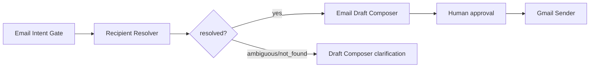

# AI Assistant Recipient Resolver Design

## Goal

AI 비서가 "김용희님한테 메일 보내줘"처럼 이메일 주소가 직접 쓰이지 않은 요청도, 이미 회사 데이터에 연락처가 있다면 자동으로 수신자를 확정하게 한다.

## Scope

이번 단계는 다음 3가지를 구현 대상으로 둔다.

1. `AuthUser`와 `demo_auth.USERS`를 내부 사용자 연락처 후보로 사용한다.
2. Gmail, Google Drive, Calendar 동기화로 저장된 `Source.raw_metadata`, `Source.author`, `Source.title`에서 연락처 후보를 추출한다.
3. 후보가 1명으로 확정되면 이메일 초안 작성에 resolved recipient를 전달하고, 후보가 없거나 여러 명이면 기존처럼 사용자에게 확인 질문을 하게 한다.

Slack profile API, 별도 People 테이블, 관리자 UI, 조직도 편집 화면은 이번 범위에 넣지 않는다. 현재 구조에 작게 붙일 수 있는 읽기 전용 resolver를 먼저 만든 뒤, 필요할 때 영속 People Directory로 확장한다.

## Architecture

새 모듈 `backend/app/assistant/recipient_resolver.py`를 추가한다.

- `RecipientCandidate`: 이름, 이메일, 직책, 부서, 출처, confidence, evidence를 담는 후보 객체
- `RecipientResolution`: `resolved`, `ambiguous`, `not_found` 상태와 후보 목록을 담는 결과 객체
- `resolve_email_recipients()`: 최신 사용자 메시지와 최근 대화 context를 받아 수신자 후보를 찾는다.

Resolver는 LLM이 아니라 결정적 검색으로 먼저 동작한다. 비용을 아끼고, 이메일 수신자처럼 안전성이 중요한 값은 모델이 지어내지 않게 하기 위함이다.

## Candidate Sources

후보 수집 순서는 다음과 같다.

1. 최근 대화 context에 나온 `이름 (email)` 또는 `Name <email>` 패턴
2. `AuthUser` 활성 사용자
3. `demo_auth.USERS`
4. `Source` 데이터
   - Gmail: `author`, `participants`, `from`, `to`, `cc`
   - Drive: `author`, `owner`, `last_modifying_user_email`
   - Calendar: `organizer_email`, `creator_email`, `attendees`

동일 이메일은 하나의 후보로 병합한다. 출처가 여러 개면 evidence를 누적하고 confidence를 올린다.

## Matching Rules

Resolver는 최신 메시지에서 이름/호칭/그룹 힌트를 추출한 뒤 후보와 비교한다.

- 이메일 주소가 메시지에 직접 있으면 그대로 확정한다.
- 이름 exact match 또는 alias match는 높은 점수로 확정한다.
- "님", "씨", "대표님", "CTO" 같은 호칭은 제거하거나 title 힌트로 사용한다.
- 부서명과 "전체"가 함께 있으면 해당 부서의 사용자들을 그룹 후보로 반환한다.
- 후보가 1명이고 confidence가 충분하면 `resolved`.
- 후보가 2명 이상이면 `ambiguous`.
- 후보가 없으면 `not_found`.

## Email Orchestration Integration

기존 구조는 유지하되 `Email Intent Gate`와 `Email Draft Composer` 사이에 resolver를 끼운다.

초안 작성 프롬프트에는 `resolved_recipients`를 JSON으로 전달한다. Draft Composer는 이 값이 있으면 해당 이메일을 수신자로 사용한다.

## Safety

- Resolver는 권한 필터의 기반 정보를 훼손하지 않는다.
- 발송은 기존과 동일하게 `pending_approval` 초안과 사용자 승인 이후에만 가능하다.
- 수신자가 애매하면 자동 발송 또는 자동 확정하지 않는다.
- 연락처 resolver 로그는 영어 `[Tool: recipient_resolver] ...` 형식으로 남긴다.

## Demo Auth

`demo_auth`는 실제 Google OAuth 세션이 없어도 로컬/테스트/데모에서 사용자의 역할, 권한, 내부 인물 정보를 재현하기 위한 계층이다. 현재 프로젝트는 실제 서비스 모드와 데모 모드를 모두 지원하므로, resolver도 `AuthUser`만 보지 않고 `demo_auth.USERS`를 함께 봐야 로컬에서 김용희/김종우 같은 내부 인물을 안정적으로 찾을 수 있다.
